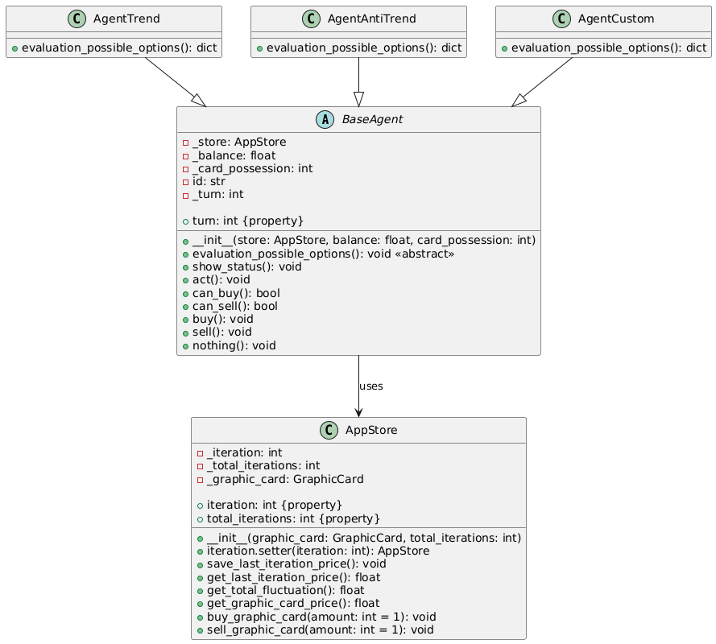

# Graphic Card Market Simulator
Este proyecto es un reto de código orientado a objetos en Python. 

## Comenzando

### Clonar este repositorio

```bash
# Clonar este repositorio
git clone https://github.com/TKadyear/graphic-card-market-simulator.git

# Entrar en el repositorio
cd graphic-card-market-simulator
```

### Ejecutar el proyecto

```bash
# Instalar las dependencias
pip install -r requirements.txt

# Ejecutar el script de simulación
python3 .
```

## Reto
El contexto del proyecto se basa en una economía basada en el intercambio de tarjetas gráficas donde hay una serie de agentes que operan con ciertas reglas.
En el mercado de tarjetas gráficas hay un stock limitado de 100.000 unidades y una serie de agentes económicos que compran y venden tarjetas gráficas en el mercado.

En cada iteración del mercado, se ordenan todos los agentes de forma aleatoria y uno a uno pueden elegir comprar una tarjeta, vender una tarjeta o no hacer nada. Cada vez que un agente compra, el precio de las tarjetas gráficas sube un 0.5%. Cada vez que un agente vende, el precio baja un 0.5%. En total en el mercado hay 100 agentes repartidos de la siguiente forma:

- **51 agentes aleatorios** que en cada iteración tienen 1/3 de probabilidades de comprar, 1/3 de probabilidades de vender y 1/3 de probabilidades de no hacer nada.

- **24 agentes tendenciales** que en cada iteración tienen un 75% de probabilidades de comprar y un25% de probabilidades de no hacer nada si el precio ha subido un 1% (o más) con respecto al final de la iteración anterior. En caso contrario tienen un 20% de probabilidades de vender y un 80% de probabilidades de no hacer nada.

- **24 agentes anti-tendenciales** que en cada iteración tienen un 75% de probabilidades de comprar y un 25% de probabilidades de no hacer nada si el precio ha bajado un 1% (o más) con respecto al final de la iteración anterior. En caso contrario tienen un 20% de probabilidades de vender y un 80% de probabilidades de no hacer nada.
- **1 agente especial** con el objetivo de maximizar su balance económico al final
de la simulación. El agente debe terminar la última iteración con cero tarjetas gráficas en su poder.

Cada agente cuenta con un **balance inicial de $1,000** y no puede tomar dinero prestado. Los agentes no pueden vender más tarjetas de las que tienen en su poder. Cada agente es consciente de que hay otros 100 agentes participando y de cómo se distribuyen las políticas de compra y venta en la población de agentes. Cada agente sabe cuál es su turno dentro de la iteración del mercado, pero desconoce la del
resto de agentes.

El mercado de tarjetas gráficas arranca con un precio unitario de $200.00 y a partir de ese momento los
agentes empiezan a operar. Se deben simular un total de 1.000 iteraciones.
## Explicación

### Estructura del proyecto
```bash
├── logs # En esta carpeta se generará simulation.log, para poder ver todas las ejecuciones.
│   └── .gitkeep
├── README.md 
├── requirements.txt # Dependencias del proyecto
└── src 
    ├── agents.py # Modulo para definir los agentes
    ├── app_store.py # Modulo para definir el singleton para consumir en la app
    ├── graphic_card.py # Modulo para definir las tarjetas gráficas
    ├── iterator.py # Modulo para definir el iterator para ordenar de manera aleatoria a los agentes cada iteracion
    ├── __main__.py 
    ├── market.py # Modulo para comenzar la simulación de mercado
    └── utils
        ├── logger.py # Modulo para hacer logs en el archivo simulation.log
        └── utils.py # Definicion de una funcion auxiliar para generar los agentes requeridos 
```

Empezando por el archivo ``__main__.py``, decidi poner en un diccionario toda la configuración de la simulación, para tener claro los parametros de ejecución. Además, si fuera necesario refactorizarlo para que admita parámetros en la ejecución de python, solo tendría que cambiar los valores fijados por los argumentos. Por lo demás, tiene una clase para comenzar la ejecución de la simulación de manera aislada, generando todo lo que sea necesario para el inicio.

En el archivo ``market.py``, añadi la clase para simular el mercado a lo largo de las 1000 iteraciones. No obstante, esta clase `MarketSimulator`,no se encarga de ordenar aleatoriamente los agentes ya que en mi perspectiva solo tiene el objetivo de ir dando el turno a cada agente, totalmente ajeno de cual es el que sigue.

Por lo que el archivo ``iterator.py``, se encuentra un iterator que de ordenar aleatoriamente cada agente y cada vez que llama a la clase devuelve el siguiente en la lista hasta que ha devuelto todos los agentes que había. Esta forma de hacerlo me permitia aislarlo y no desvelar la posición de cada agente, además de darle el valor de que turno tienen. Aunque después no haya usado el valor de `turn` en ninguna lógica.

Con respecto a los agentes, decidi hacer una clase abstracta para que después cada Clase hija tuviera un método para evaluar cuales era las posibles opciones. A la hora de desarrollar me vi en la necesidad de tener diferentes parÁmetros en las funciones de comprar o vender que posteriormente. Asi que vi la clara necesidad de tener una unica instancia que se encargue de dar el estado de otras clases como `GraphicCard`. De esta manera, me permitia tener bastante flexibilidad en cómo desarrollar las decisiones de cada tipo de agente sin necesidad de que se pasen argumentos a la función.
Cabe destacar que la lógica del último agente, intenta aumentar las probabilidades de que decida una accion o no hacer nada, en base a las iteraciones y si la fluctuación del precio es mayor a 5% que haga más probable que compre o venda en base a si esta la fluctuacion en positivo o negativo. Por último, una vez se llega a las últimas 10 iteraciones el foco de este agente es vender las tarjetas, aunque no he tenido forma de asegurar que termine siempre sin tarjetas gráficas.


[Link a PlantUml con la definición del diagrama de clases](https://editor.plantuml.com/uml/hLLBZjim3DqRy1sucmHD2dHhJ8D9i-Y-qxr1ovn4W2Av4fKYcEP8FKKlLZgElt2cHL5lRF4zafBuI3y5Hi_nQD8aJHvWPp0GO17OesA42Zs2SG5mJvOff4cBWH9gW4_2tzOOlAO9oBE6FB3pbC6sgfxhhyvUe46h17an3hapA_HbNhaGA0JjR0RQTg0kCv1y7PUZRmcDxHtakRQQytmnIRk2SRuLp2LQjc7eX2OYY_rAqOMXt5NrEYoM6PoSBk7niJtzPjFwTJk2rygxYZoVBoqM3kwxt0Pox6AqaCIOcXJQl8ZdsbmuPuRcGCPCxJVgC49B6zgiuuEs-zvy6LOw26I8dMqgNRcIFCI07agfgNVoUkjcLW9gHbiw87lIueP-7u_YAf8X2mRX9LebL3WZV8iaMWBbZfNHKenVFn7IfD5HMxM1Z3IJlwOTAI9dnsXwC8pHlSVgeDLLL1byRbOxMSm8vYvt1RD9EgsCTpPJ-5dt6Lx7U1-8vNinZhoSDf6K64-Kourn7psll5OqhVkU-2vlq7yDiTdlYucAcqhFieRtTIUOY794M-3HHSlD-J_2Xnd1_Xt_KclsEHQrMYY8Xgpon1Ww_TGpwAidMxOA-cDBbrhnhHq6CRQMzV-8iuioZux_4kG1lf31kcdgUTiFsFLwqxT99brQmuDphzS_Dlqyla7zSMRXsowdM9eyYSlrh_0R)

El archivo de ``app_store.py`` devuelve siempre la misma instancia de la clase ``AppStore`` ya que la metaclase que tiene definida hace que si no existe una instancia antes, cree una y la almacena. En todo el código solo hay una referencia al `AppStore`, que es en la clase `Setup` a partir de la cual se va injectando la dependencia en donde sea necesario.
La clase de `AppStore` actua como un mediador para coger datos de `GraphicCard`, sin tener que exponer la clase y tiene datos generales del mercado que eran necesarios para alguno de los agentes que se han definido.


## Autora

* GitHub - [TKadyear](https://github.com/TKadyear)
* LinkedIn - [Tamara Kadyear Saber](https://www.linkedin.com/in/tamara-kadyear-saber/)